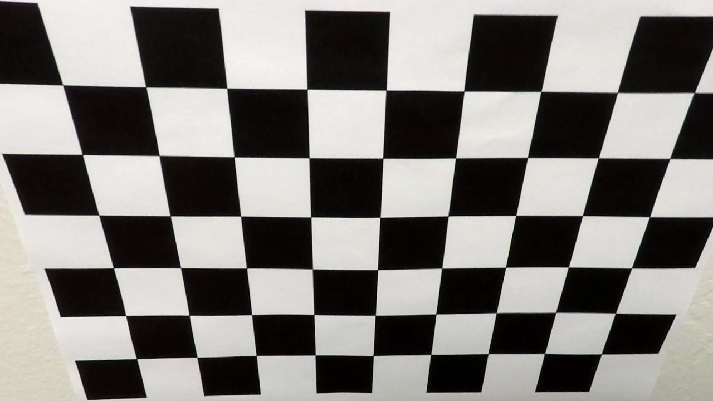
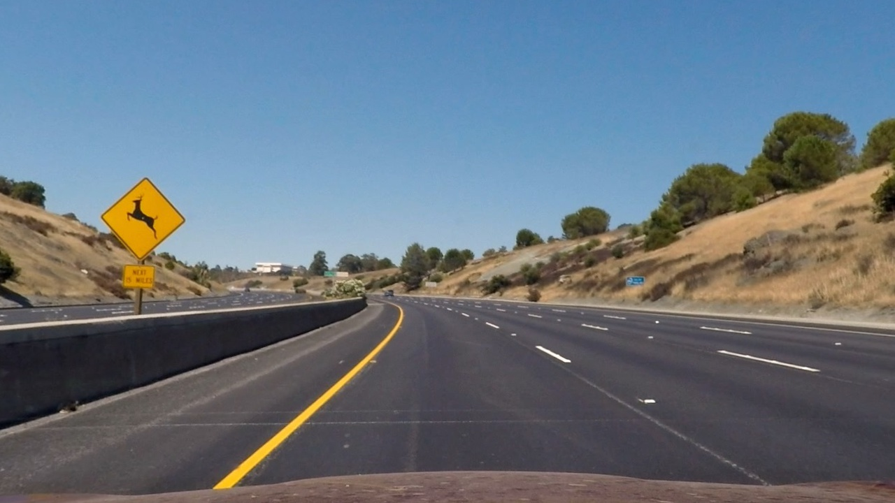
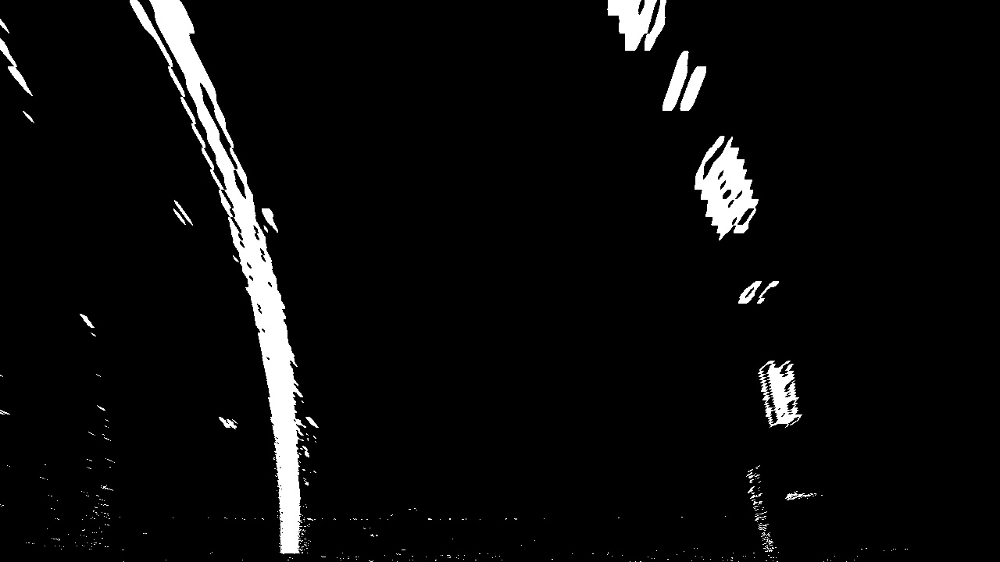
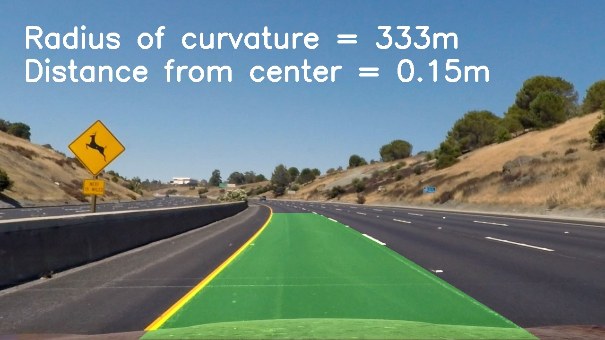

## Writeup Template

---

**Advanced Lane Finding Project**

The goals / steps of this project are the following:

* Compute the camera calibration matrix and distortion coefficients given a set of chessboard images.
* Apply a distortion correction to raw images.
* Use color transforms, gradients, etc., to create a thresholded binary image.
* Apply a perspective transform to rectify binary image ("birds-eye view").
* Detect lane pixels and fit to find the lane boundary.
* Determine the curvature of the lane and vehicle position with respect to center.
* Warp the detected lane boundaries back onto the original image.
* Output visual display of the lane boundaries and numerical estimation of lane curvature and vehicle position.

## [Rubric](https://review.udacity.com/#!/rubrics/571/view) Points

### Here I will consider the rubric points individually and describe how I addressed each point in my implementation.  

---

### Writeup / README

### Camera Calibration

#### 1. Briefly state how you computed the camera matrix and distortion coefficients. Provide an example of a distortion corrected calibration image.

regarding camera calibration, i used a well known shape (chessboard) to calibrate my camera. It was a 9x6 chessboard so i used the opencv function `cv2.findChessBoardCorners()` to get the chessboard corners. Then, i used `dcv2.rawChessboardCorners()` to ensure that it was found correctly. After that i used two empty array `imgPoints` & `objPoints`to store image and object points which i used with the function `cv2.calibrateCamera` to get the camera and distortion matrices. I then used these matrices on every frame or image to undistort it using the opencv function `cv2.undistort()`. Here is an example of the result on a calibration image.

|
original image
 |
 undistorted image
|
--------------- |------------------
|

### Pipeline (single images)

#### 1. Provide an example of a distortion-corrected image.

Now that i've got the camera and undistortion matrices, i can use them on every image or frame to get the undistorted image.i used the `undistortImg` function which is in the helper function to undistort the image. Here is an example image after undistorting it

#### 2. Describe how (and identify where in your code) you used color transforms, gradients or other methods to create a thresholded binary image.  Provide an example of a binary image result.

I used a combination of color and gradient thresholds to generate a binary image. I used HLS color space to get the color and gradient images and i combined them later to get the final binary image. for the color image, i converted the image to HLS and extracted the `s` layer and applied a threshold to it. for the gradient image,  converted the image to HLS and extracted the `l` layer and then, i used sobelx on that image and used a threshold to get only the lanes. This step can be found in the `findLanes` function

Here's an image with the final result

#### 3. Describe how (and identify where in your code) you performed a perspective transform and provide an example of a transformed image.

The code for my perspective transform exists in the `findLanes` function -line 31 to 35- as well as two helper functions: `perspectiveTransform` and `warpPerspective`. I used four source points i got by tuning them -can be found in `prespective.jpg` image- on a straight line images in the `test_images` directory and the four destination points i got by eyeballing four good cordinates. I got the M and Minv matrices to warp the images as i like.

Here is a sample of a warped image for the same image from above

#### 4. Describe how (and identify where in your code) you identified lane-line pixels and fit their positions with a polynomial?

Then I did some other stuff and fit my lane lines with a 2nd order polynomial kinda like this:
I separated images and videos processing as follows:
For images:
* I used sliding window method which exists in the helper function `find_lane_pixels`
For videos:
1. In the first frame, i used the sliding window method
2. Then i used a highly targeted search around the polynomial that was fitted in the previous frame with some margin around it. This can be found in `search_around_poly` helper function
3. I got the left and right lane polynomial fits using `np.polyfit` function
4. I added this fit with the last 5 fits and got the average of them to allow for smoothing
5. i plotted the polynomials on the warped image

**note**: regarding the frames in which the left and right lane weren't similar, i neglected the measurements and used the previous `best_fit` on that frame

#### 5. Describe how (and identify where in your code) you calculated the radius of curvature of the lane and the position of the vehicle with respect to center.

I did this in the function `measureCurvature` in the helper functions section. I used the left and right lanes fit with the formula below to measure the cuvature at the car position. That would give me the curvature in the pixels world so i had to transform it to the original where we would measure things by meters and this is also provided in the `measureCurvature` in the `ym_per_pix` & `xm_per_pix`

regarding the vechile position with respec to center, i did that in the `findLanes` function (lines 93 to 99). I got the center of the image and the center of the lanes in the top row of the image -that row wouldn't be affected by the transform- and subtracted the two and devided them by the number of pixels which would lead to 3.7 meters(got it while doing the prespective transform)

#### 6. Provide an example image of your result plotted back down onto the road such that the lane area is identified clearly.

I implemented this step in lines 100 to the end of the `findLanes` function.

Here is an image of the result.

---

### Pipeline (video)

#### 1. Provide a link to your final video output.  Your pipeline should perform reasonably well on the entire project video (wobbly lines are ok but no catastrophic failures that would cause the car to drive off the road!).

Here's a [link to my video result](./output_videos/output_project_video.mp4)

---

### Discussion

#### 1. Briefly discuss any problems / issues you faced in your implementation of this project.  Where will your pipeline likely fail?  What could you do to make it more robust?

Here I'll talk about the approach I took, what techniques I used, what worked and why, where the pipeline might fail and how I might improve it if I were going to pursue this project further.

First, i had a hard time getting accurate results for the radius of curvature especially when the two lanes were almost vertical so that the first term (the one associated with the squared power) was so small ($10^{-1}$ order of magnitude) and that little difference between them caused a large difference and error in the radius measument.

I also think that the pipeline would fail if there is some color differences on the road or high curvature so i would make it track the lines using the sliding window search when the pipeline loses the lanes positions for like 3 or 4 frames in a row.

I would also try to use angle of gradient in binary image making as i think it would be somewhat helpful.
